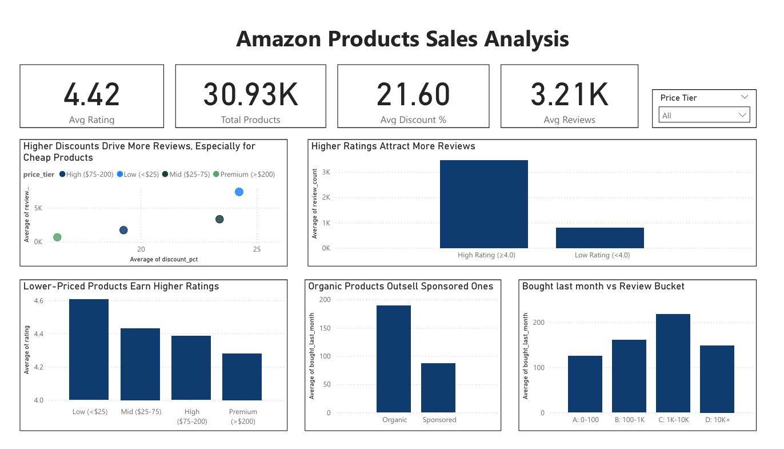

# Amazon Products Sales Analysis

**Business objective:** Understand how pricing, discounts, and customer ratings relate to product engagement, supporting pricing and merchandising decisions for Amazon sellers.

---

## Tools & Technologies

- **Python** (Pandas, NumPy, Matplotlib, Seaborn, SciPy) - data cleaning, feature engineering, and exploratory analysis
- **Jupyter Notebook** - analysis and documentation
- **Power BI** - interactive dashboard and visualization
- **Dataset:** [Amazon Products Dataset — Kaggle](https://www.kaggle.com/code/mohamedasak/amazon-products-sales-eda) (~42,000 products, collected August 2025)

---

## Business Questions

1. Does a higher discount correlate with more reviews or better ratings?
2. Do higher-rated products attract more engagement?
3. Are low-priced products more likely to receive extreme ratings?
4. Do sponsored products outperform organic ones?

---

## Project Structure

```
Amazon_Products_Sales_Analysis_Complete.ipynb   # Full analysis notebook
amazon_analysis_powerbi.csv                     # Cleaned export for Power BI
amazon_dashboard.pbix                           # Power BI dashboard file
```

---

## Key Findings

### 1. Discounts drive reviews, but only up to a point
Higher discounts correlate with more reviews, especially for budget products (<$25). The sweet spot is the **20–30% discount range**, which peaks at ~1,117 median reviews. Extreme discounts (70%+) are associated with very low engagement (~14 reviews), suggesting those products may be struggling regardless of the discount.

### 2. Higher-rated products attract significantly more reviews
Products rated ≥4.0 average ~3,400 reviews compared to ~800 for lower-rated products. There is a modest but meaningful positive relationship (r = 0.21 on log scale) between rating and review count, quality signals drive engagement.

### 3. Lower-priced products earn higher ratings
Budget products (<$25) average a rating of 4.6, compared to 4.3 for premium products (>$200). This likely reflects higher customer expectations for expensive products, or budget products over-delivering on perceived value. Notably, 33% of low-price products have extreme ratings vs. only 12% of high-price products.

### 4. Organic products outsell sponsored ones
Organic products average ~190 units bought last month vs. ~85 for sponsored products. Sponsored and organic products have virtually identical ratings (4.42), meaning sponsorship buys visibility but not perceived quality. Organic rankings reflect genuine product-market fit.

### 5. Reviews sweet spot: 1K–10K drives the most sales
Products with 1,000–10,000 reviews have the highest average monthly purchases (~225). Products with 10K+ reviews see a drop in sales velocity, suggesting they may be older/saturated products rather than actively growing ones.

### 6. Coupons don't drive more sales
Products without coupons average ~175 units bought last month vs. ~130 for coupon products. Coupons appear to be a signal of a struggling product rather than a sales accelerator.

---

## Dashboard Preview



The Power BI dashboard includes:
- 4 KPI cards (Avg Rating, Total Products, Avg Discount %, Avg Reviews)
- Interactive Price Tier slicer
- 5 charts covering all business questions

---

## Data Cleaning Highlights

The raw dataset required significant preprocessing before analysis:
- Parsed rating strings ("4.6 out of 5 stars") into numeric values
- Extracted purchase counts from strings ("6K+ bought in past month")
- Cleaned price columns and calculated discount percentages
- Created engineered features: `price_tier`, `discount_range`, `high_rating`, `review_bucket`
- Removed nulls and standardized binary flags for Power BI compatibility
